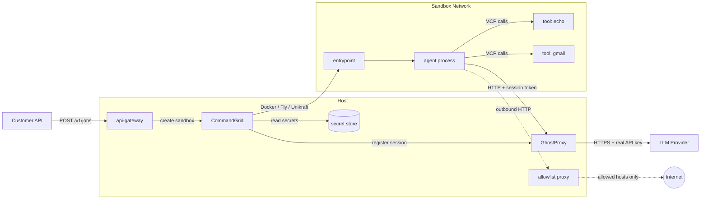
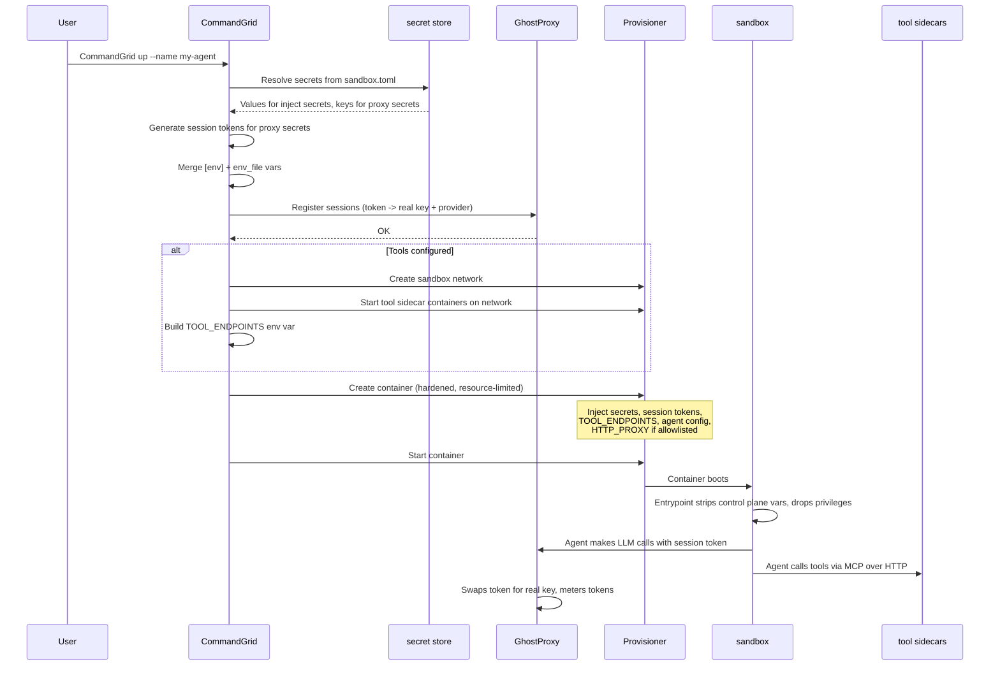
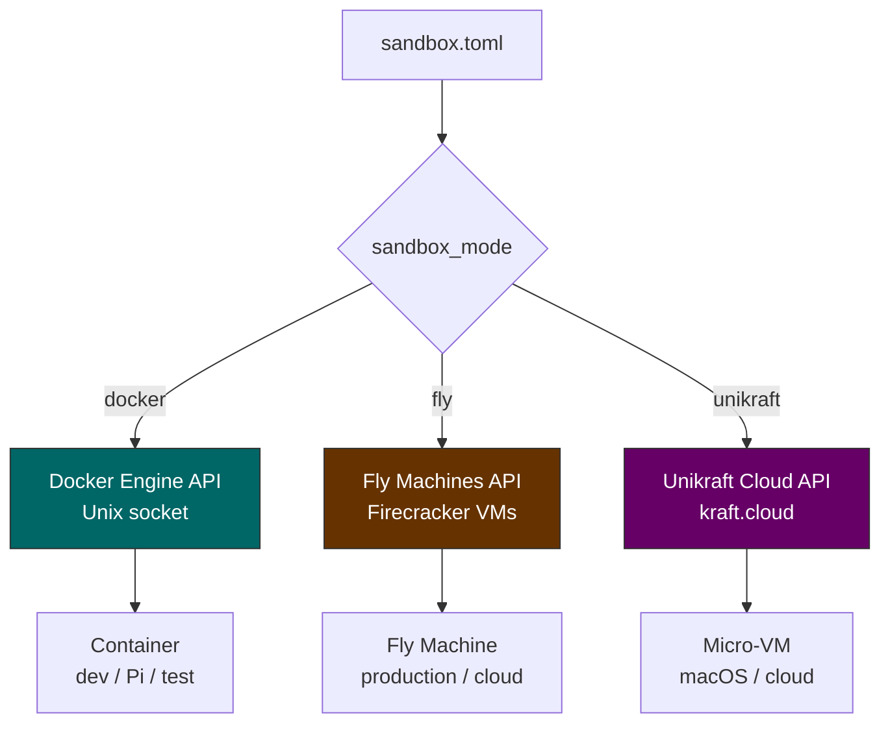
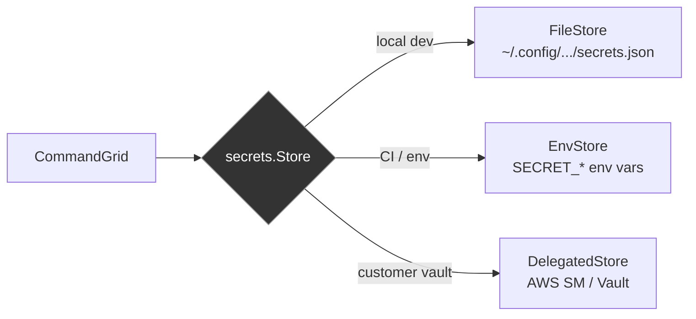

# CommandGrid

The orchestrator for the agent sandbox system. Reads a `sandbox.toml` config, manages a pluggable secret store, provisions sandboxes (Docker, Fly Machines, or Unikraft), coordinates [GhostProxy](https://github.com/Travbz/GhostProxy) for credential proxying, and spins up MCP tool sidecars. One command to boot a fully isolated agent environment with the hybrid credential model.

## System overview

| Repo | What it does |
|---|---|
| **[CommandGrid](https://github.com/Travbz/CommandGrid)** | This repo -- orchestrator, config, secrets, provisioning, tools, memory, billing |
| **[GhostProxy](https://github.com/Travbz/GhostProxy)** | Credential-injecting LLM reverse proxy with token metering |
| **[RootFS](https://github.com/Travbz/RootFS)** | Container image -- entrypoint, env stripping, privilege drop |
| **[api-gateway](https://github.com/Travbz/api-gateway)** | Customer-facing REST API -- job submission, SSE streaming, billing |
| **[ToolCore](https://github.com/Travbz/ToolCore)** | MCP tool monorepo -- spec, reference tools |
| **[JudgementD](https://github.com/Travbz/JudgementD)** | Reference agent implementation |

---

## Architecture



---

## Getting started

### Prerequisites

- **Go 1.24+**
- **Docker** (Docker Desktop on Mac, Docker Engine on Linux/Pi)
- All repos cloned as siblings:

```
~/projects/
├── CommandGrid/    # this repo
├── GhostProxy/
├── RootFS/
├── api-gateway/      # optional: customer-facing API
├── ToolCore/         # optional: MCP tool sidecars
└── JudgementD/       # optional: reference agent
```

### Quick setup (automated)

```bash
cd CommandGrid
./setup.sh
```

Builds all three core services, prompts for your Anthropic API key, and drops a ready-to-run hello-world example in `my-first-sandbox/`.

### Manual setup

```bash
# 1. Build the LLM proxy
cd ../GhostProxy && make build

# 2. Build the sandbox container image
cd ../RootFS && make image-local

# 3. Build the control plane
cd ../CommandGrid && make build
```

### Adding credentials

CommandGrid stores secrets in `~/.config/CommandGrid/secrets/`. Add them by name -- these names are what you reference in `sandbox.toml`.

```bash
# LLM key -- will be proxied, never enters the sandbox
./build/CommandGrid secrets add --name anthropic_key --value "sk-ant-api03-..."

# Direct-inject secrets -- these go straight into the sandbox as env vars
./build/CommandGrid secrets add --name github_token --value "ghp_..."

# Verify
./build/CommandGrid secrets list
```

### Hello world

The `examples/hello-world/` directory proves the full flow end to end.

```bash
# terminal 1 -- start the proxy
../GhostProxy/build/ghostproxy -addr :8090

# terminal 2 -- boot the sandbox
cd examples/hello-world
../../build/CommandGrid up --name hello-world
```

Or the all-in-one script:

```bash
cd examples/hello-world && ./run.sh
```

What this does:

1. Reads `sandbox.toml`, sees `anthropic_key` with `mode = "proxy"`
2. Generates a session token, registers it with the proxy (real key stays on host)
3. Creates a Docker container with `ANTHROPIC_API_KEY=session-<token>` and `ANTHROPIC_BASE_URL=http://host.docker.internal:8090`
4. Agent script calls Anthropic through the proxy
5. Proxy swaps token for real key, forwards to Anthropic
6. Claude responds. Real API key never entered the container.

---

## The boot sequence



---

## Hybrid credential model

Each secret in `sandbox.toml` has a mode:

| Mode | What happens | Good for |
|---|---|---|
| `proxy` | Real key stays on host. Sandbox gets a session token. LLM calls go through GhostProxy which injects the real key. | LLM API keys (high value, high risk) |
| `inject` | Real value injected directly as an env var into the sandbox. | SSH keys, registry tokens, git credentials |

```toml
[secrets.anthropic_key]
mode = "proxy"
env_var = "ANTHROPIC_API_KEY"
provider = "anthropic"

[secrets.github_token]
mode = "inject"
env_var = "GITHUB_TOKEN"
```

When a proxied secret is configured, CommandGrid injects two env vars per provider:

| Provider | API key env var | Base URL env var |
|---|---|---|
| Anthropic | `ANTHROPIC_API_KEY` (session token) | `ANTHROPIC_BASE_URL` (proxy URL) |
| OpenAI | `OPENAI_API_KEY` (session token) | `OPENAI_BASE_URL` (proxy URL) |
| Ollama | `OLLAMA_API_KEY` (session token) | `OLLAMA_HOST` (proxy URL) |

Standard SDKs read these env vars and route through the proxy automatically. No code changes needed in the agent.

---

## Config (`sandbox.toml`)

```toml
sandbox_mode = "docker"           # "docker", "fly", or "unikraft"
image = "RootFS:latest"

[proxy]
addr = ":8090"

[agent]
command = "claude"
args = ["--model", "sonnet"]
user = "agent"
workdir = "/workspace"

# Environment variables (plain, no secret management)
[env]
LOG_LEVEL = "debug"
NODE_ENV = "production"

# Or load from a file
env_file = ".env"

# Secrets with injection modes
[secrets.anthropic_key]
mode = "proxy"
env_var = "ANTHROPIC_API_KEY"
provider = "anthropic"

[secrets.github_token]
mode = "inject"
env_var = "GITHUB_TOKEN"

# Shared directories
[[shared_dirs]]
host_path = "./workspace"
guest_path = "/workspace"

# Resource limits
[resources]
memory = "512m"
cpus = "1"

# MCP tool sidecars
[[tools]]
name = "echo"
image = "ghcr.io/yourorg/tool-echo:latest"
transport = "http"
port = 8080

# Network restrictions (empty = unrestricted)
[network]
allowed_hosts = ["api.anthropic.com", "*.github.com"]
proxy_port = 3128
```

---

## Sandbox runtimes

The provisioner interface abstracts the sandbox backend. A single config switch selects which runtime to use:



- **Docker** -- Local Docker daemon over Unix socket. Dev, test, Raspberry Pi. Containers get `host.docker.internal` for reaching the proxy on the host.
- **Fly Machines** -- Firecracker VMs via the Fly Machines REST API. Production multi-tenant isolation. Configurable region and machine size.
- **Unikraft** -- kraft.cloud REST API for ultra-lightweight micro-VMs. Needs `UKC_TOKEN` env var.

### Container hardening (Docker)

Docker sandboxes get automatic security hardening:

- All capabilities dropped (`CAP_DROP: ALL`)
- No privilege escalation (`no-new-privileges`)
- Read-only root filesystem
- Writable tmpfs at `/tmp` and `/run` only
- Optional memory and CPU limits via `[resources]`

---

## Secret store backends

The secret store is pluggable. Multiple backends implement the same interface:



| Backend | When to use | Set/Delete | Persistence |
|---|---|---|---|
| `FileStore` | Local dev, Pi | Yes | JSON file, 0600 perms |
| `EnvStore` | CI pipelines, containers | No (read-only at runtime) | Env vars / .env file |
| `DelegatedStore` | Multi-tenant production | No (customer manages) | AWS Secrets Manager or HashiCorp Vault |

The `DelegatedStore` fetches secrets from a customer's own vault at runtime with a short TTL cache. Customers rotate and manage their own credentials -- CommandGrid never stores them.

---

## Network allowlisting

When `[network] allowed_hosts` is set, the sandbox can only reach those domains. A lightweight forward proxy runs on the host and the sandbox routes all HTTP(S) traffic through it:

```toml
[network]
allowed_hosts = ["api.anthropic.com", "*.github.com", "registry.npmjs.org"]
proxy_port = 3128
```

- Supports exact match and wildcard subdomains
- Handles both HTTPS tunnels (CONNECT) and plain HTTP
- Logs blocked requests for audit
- `NO_PROXY` is set automatically for intra-sandbox traffic (localhost, tool sidecars)

---

## MCP tools

Tools are standalone Docker containers that speak MCP. They run as sidecars on the sandbox network.

```toml
[[tools]]
name = "echo"
image = "ghcr.io/yourorg/tool-echo:latest"
transport = "http"
port = 8080

[tools.env]
API_KEY = "inject:some_api_key"
```

The orchestrator:
1. Creates an isolated Docker network for the sandbox
2. Starts each tool container on that network
3. Builds a `TOOL_ENDPOINTS` env var (e.g. `echo=http://echo:8080`)
4. Injects it into the agent container

Tool env values prefixed with `inject:` are resolved from the secret store.

---

## Server mode

For production, CommandGrid can run as an HTTP server:

```bash
CommandGrid serve --listen :8091
```

This exposes an internal API for the [api-gateway](https://github.com/Travbz/api-gateway):

| Method | Path | Description |
|---|---|---|
| `POST` | `/internal/v1/sandboxes` | Create and start a sandbox |
| `GET` | `/internal/v1/sandboxes` | List all sandboxes |
| `GET` | `/internal/v1/sandboxes/{id}` | Get sandbox status |
| `DELETE` | `/internal/v1/sandboxes/{id}` | Destroy a sandbox |

---

## Memory and personalization

### Memory store

The memory package provides conversation history and semantic fact storage with pluggable backends:

| Backend | Use case | Semantic search |
|---|---|---|
| `SQLiteStore` | Local dev, single-node | No (returns empty) |
| `PostgresStore` | Production, multi-tenant | Yes (via pgvector) |

### Customer profiles

Per-customer configuration for personalization:

```json
{
  "customer_id": "acme-corp",
  "system_prompt_additions": "Always respond in a formal tone.",
  "default_tools": ["gmail", "calendar"],
  "memory_enabled": true,
  "secrets_provider": {
    "type": "aws_sm",
    "region": "us-east-1",
    "role_arn": "arn:aws:iam::role/acme-secrets"
  },
  "max_concurrent_jobs": 5,
  "token_budget": 1000000
}
```

---

## Usage

### Managing secrets

```bash
CommandGrid secrets add --name anthropic_key --value "sk-ant-..."
CommandGrid secrets add --name github_token --value "ghp_..."
CommandGrid secrets list
CommandGrid secrets rm --name old_key
```

### Running sandboxes (CLI)

```bash
CommandGrid up --name my-agent              # reads sandbox.toml
CommandGrid status                          # list all sandboxes
CommandGrid status --id <container-id>      # single sandbox
CommandGrid down --id <container-id>        # stop and destroy
```

### Running as a server

```bash
CommandGrid serve --listen :8091
```

---

## Building

```bash
make build    # builds to ./build/CommandGrid
make test     # runs all tests
make lint     # golangci-lint
make vet      # go vet
```

---

## Project structure

```
CommandGrid/
├── main.go
├── cmd/
│   ├── up.go                        # start a sandbox
│   ├── down.go                      # stop + destroy
│   ├── status.go                    # sandbox status / list
│   ├── secrets.go                   # secrets add/rm/list
│   ├── serve.go                     # HTTP server mode
│   └── helpers.go
├── pkg/
│   ├── config/
│   │   └── config.go                # sandbox.toml parsing + validation
│   ├── secrets/
│   │   ├── iface.go                 # Store interface
│   │   ├── store.go                 # FileStore (JSON file)
│   │   ├── env.go                   # EnvStore (env vars / .env file)
│   │   ├── delegated.go             # DelegatedStore (AWS SM / Vault)
│   │   └── session.go               # session token generation
│   ├── provisioner/
│   │   ├── provisioner.go           # Provisioner interface
│   │   ├── docker.go                # Docker Engine API backend
│   │   ├── fly.go                   # Fly Machines API backend
│   │   └── unikraft.go              # Unikraft Cloud API backend
│   ├── orchestrator/
│   │   └── orchestrator.go          # boot sequence + tool orchestration
│   ├── allowlist/
│   │   └── proxy.go                 # outbound traffic allowlist proxy
│   ├── agent/
│   │   └── contract.go              # agent I/O contract types
│   ├── memory/
│   │   ├── iface.go                 # Store interface
│   │   ├── sqlite.go                # SQLite backend
│   │   └── postgres.go              # PostgreSQL + pgvector backend
│   └── customer/
│       └── profile.go               # customer profile + secret provider config
├── examples/
│   └── hello-world/
│       ├── sandbox.toml
│       ├── agent.sh
│       └── run.sh
├── docs/
│   ├── architecture.md
│   ├── configuration.md
│   ├── credentials.md
│   ├── provisioners.md
│   ├── secret-store.md
│   └── PRD-discovery.md
├── setup.sh
├── Makefile
├── go.mod
├── .releaserc.yaml
└── .github/workflows/
    ├── ci.yaml
    └── release.yaml
```

---

## Versioning

Automated with [semantic-release](https://github.com/semantic-release/semantic-release) from [conventional commits](https://www.conventionalcommits.org/).
