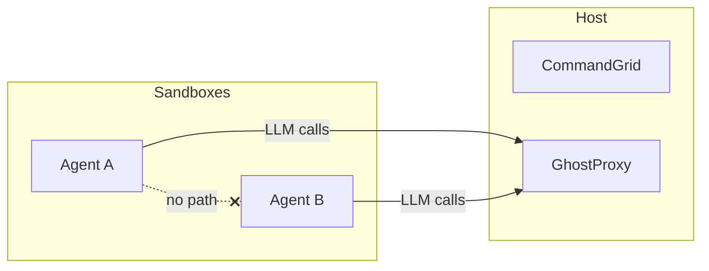
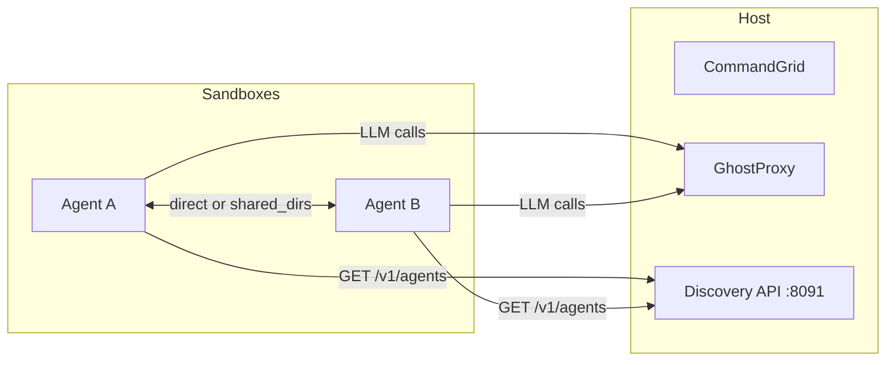

# PRD: Agent Discovery

## Problem

Right now every sandbox is a black box. An agent boots, gets its session token and proxy URL, and does its work in total isolation. There is no mechanism for one agent to know that other agents exist, what they are doing, or how to reach them.

This is fine for single-agent workflows. It breaks down when you want agents to coordinate — delegating subtasks, sharing intermediate results, or building pipelines where agent A's output feeds into agent B.

## Goal

Add a discovery API to CommandGrid so sandboxes can query for other running agents and get enough metadata to establish communication. CommandGrid already tracks every sandbox (provisioner.List), so this is mostly about exposing that state through a new HTTP endpoint and injecting the right env vars so sandboxes know how to call it.

## Non-goals

- **Agent-to-agent transport.** This PRD covers discovery (who exists and where), not the communication channel itself. Agents can use HTTP, shared directories, or whatever fits once they have each other's coordinates.
- **Orchestration / task assignment.** CommandGrid tells agents about each other. It does not decide who does what.
- **Authentication between agents.** Session tokens authenticate agents to the proxy. Inter-agent auth is a separate concern. We may revisit this, but v1 ships without it.
- **Persistent agent registry.** Discovery is ephemeral. If a sandbox goes down, it disappears from the registry. No database.

## Architecture

### Current state



Agent A and Agent B have no awareness of each other. CommandGrid knows both exist (it created them), but that information is locked inside the host CLI.

### Proposed state



CommandGrid exposes a lightweight HTTP discovery API. Sandboxes call it to learn about peers. Communication happens out of band (direct HTTP between containers, shared filesystem, etc).

## API Design

### `GET /v1/agents`

Returns all currently running sandboxes. Authenticated by session token (same token the agent already has for LLM calls).

**Request:**

```
GET /v1/agents
Authorization: Bearer <session-token>
```

**Response (200):**

```json
{
  "agents": [
    {
      "id": "abc123",
      "name": "code-reviewer",
      "status": "running",
      "ip": "172.17.0.3",
      "labels": {
        "role": "reviewer",
        "project": "CommandGrid"
      },
      "started_at": "2026-02-27T10:30:00Z"
    },
    {
      "id": "def456",
      "name": "test-runner",
      "status": "running",
      "ip": "172.17.0.4",
      "labels": {
        "role": "tester",
        "project": "CommandGrid"
      },
      "started_at": "2026-02-27T10:31:00Z"
    }
  ]
}
```

The calling agent's own entry is included in the response (agents can identify themselves by `SESSION_ID`).

### `GET /v1/agents/{id}`

Returns a single agent by ID.

**Response (200):**

```json
{
  "id": "abc123",
  "name": "code-reviewer",
  "status": "running",
  "ip": "172.17.0.3",
  "labels": {
    "role": "reviewer",
    "project": "CommandGrid"
  },
  "started_at": "2026-02-27T10:30:00Z"
}
```

**Response (404):**

```json
{
  "error": "agent not found"
}
```

### `PUT /v1/agents/{id}/labels`

Allows an agent to set labels on itself. Labels are key-value pairs that other agents can use for filtering. Only the agent that owns the ID can update its labels (enforced by session token).

**Request:**

```json
{
  "role": "reviewer",
  "project": "CommandGrid",
  "capabilities": "code-review,linting"
}
```

**Response (200):**

```json
{
  "status": "updated"
}
```

### Query parameters

`GET /v1/agents` supports filtering:

| Param | Example | Description |
|---|---|---|
| `label` | `?label=role:reviewer` | Filter by label key:value |
| `status` | `?status=running` | Filter by status |
| `name` | `?name=code-reviewer` | Filter by exact name |

Multiple `label` params are AND-ed.

## Data Model

### Agent record (in-memory)

```go
type AgentRecord struct {
    ID        string            // sandbox/container ID
    Name      string            // from sandbox.toml or CLI --name
    Status    string            // running, stopped, etc (from provisioner)
    IP        string            // container/VM IP
    Labels    map[string]string // mutable, set by the agent itself
    StartedAt time.Time         // when the sandbox was started
    SessionID string            // maps back to the session token owner
}
```

This is not persisted. When CommandGrid restarts, it rebuilds the registry by calling `provisioner.List()` and cross-referencing with active proxy sessions.

### Relationship to existing types

The `AgentRecord` is derived from `provisioner.Sandbox`:

```
provisioner.Sandbox.ID     -> AgentRecord.ID
provisioner.Sandbox.Name   -> AgentRecord.Name
provisioner.Sandbox.Status -> AgentRecord.Status
provisioner.Sandbox.IP     -> AgentRecord.IP
```

`Labels` and `StartedAt` are new fields tracked by the discovery service.

## Config Changes

### sandbox.toml

Add optional `labels` to the agent config:

```toml
[agent]
command = "claude"
args = ["--model", "sonnet"]
labels = { role = "reviewer", project = "CommandGrid" }
```

These are the initial labels set at boot. The agent can update them at runtime via the API.

### Discovery port

Add a `discovery` section to the proxy config:

```toml
[discovery]
addr = ":8091"
```

Default: `:8091`. The discovery API runs as a separate listener in the CommandGrid process (not inside GhostProxy — it needs access to the provisioner state).

## Environment Variables

The orchestrator injects these into every sandbox at boot:

| Var | Value | Purpose |
|---|---|---|
| `DISCOVERY_URL` | `http://host.docker.internal:8091` | Base URL for the discovery API |
| `AGENT_ID` | The sandbox ID | So the agent knows its own identity |

These join the existing `CONTROL_PLANE_URL`, `SESSION_TOKEN`, and `SESSION_ID` vars (which get stripped by the entrypoint). `DISCOVERY_URL` and `AGENT_ID` are **not** stripped — agents need them at runtime.

## Auth

Session tokens double as discovery auth. The agent already has a session token for LLM proxy calls. The discovery API validates the same token against the proxy's session store (or a shared session registry if we split them later).

This means:

- Only running agents with valid sessions can query the registry
- When a session is revoked (sandbox torn down), the agent loses discovery access too
- No new credential type needed

## Implementation Plan

### Phase 1: Read-only discovery

1. Add `pkg/discovery/registry.go` — in-memory agent registry backed by provisioner.List
2. Add `pkg/discovery/server.go` — HTTP handlers for `GET /v1/agents` and `GET /v1/agents/{id}`
3. Wire into `main.go` — start the discovery server alongside the existing CLI
4. Update orchestrator — inject `DISCOVERY_URL` and `AGENT_ID` env vars on boot
5. Update entrypoint — keep `DISCOVERY_URL` and `AGENT_ID` (don't strip them)
6. Add `labels` field to `AgentConfig` in config.go

### Phase 2: Mutable labels

7. Add `PUT /v1/agents/{id}/labels` handler with session token ownership check
8. Add label-based filtering to `GET /v1/agents`

### Phase 3: Events (future, not scoped here)

9. SSE endpoint `GET /v1/agents/events` for real-time join/leave notifications
10. Agents can subscribe and react when peers come and go

## Package Layout (after implementation)

```
pkg/
├── config/          # existing — add labels field
├── secrets/         # existing — unchanged
├── provisioner/     # existing — unchanged
├── orchestrator/    # existing — inject DISCOVERY_URL, AGENT_ID
└── discovery/       # new
    ├── registry.go  # AgentRecord, in-memory store, refresh from provisioner
    ├── server.go    # HTTP handlers (list, get, update labels)
    └── server_test.go
```

## Security Considerations

- **No secrets leak through discovery.** The agent record contains ID, name, IP, status, labels. No session tokens, no API keys, no env vars.
- **Agents can only modify their own labels.** The PUT endpoint checks that the session token maps to the agent ID being modified.
- **Discovery is internal only.** The `:8091` port is bound to the host. Sandboxes reach it through `host.docker.internal`. It is not exposed to the internet.
- **Rate limiting.** Not in v1. If an agent hammers the discovery endpoint, that is a problem for later. The provisioner.List call hits the Docker socket, so there is a natural ceiling.

## Open Questions

1. **Should agents be able to send messages through CommandGrid?** Right now discovery just provides coordinates. Agents have to figure out transport themselves. A simple `POST /v1/agents/{id}/messages` endpoint with a small mailbox could be useful, but it adds state and complexity.

2. **Health checks.** The registry reflects provisioner state (container running vs stopped). Should we add application-level health? An agent could be running but hung. Heartbeat endpoint? Or is that the agent's problem?

3. **Namespace / grouping.** If you run 20 agents across 5 different projects, should discovery be scoped per-project? Or is label filtering enough?

4. **TTL on stale entries.** If a container crashes without a clean shutdown, the provisioner might still report it as running for a while. Should the registry have a TTL sweep, or do we trust the provisioner to eventually reflect reality?
