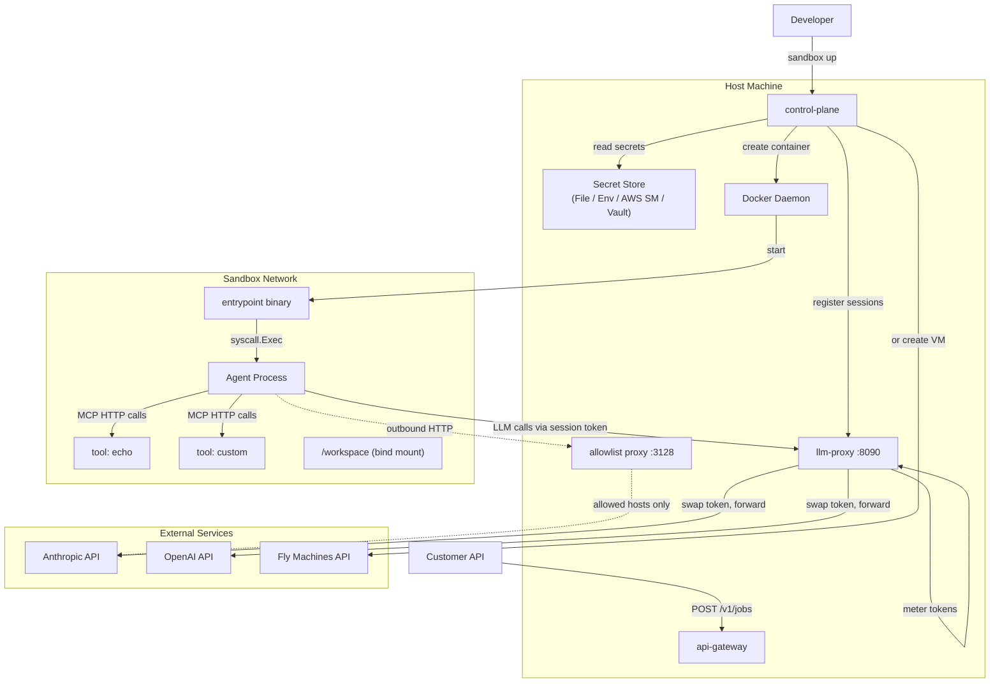
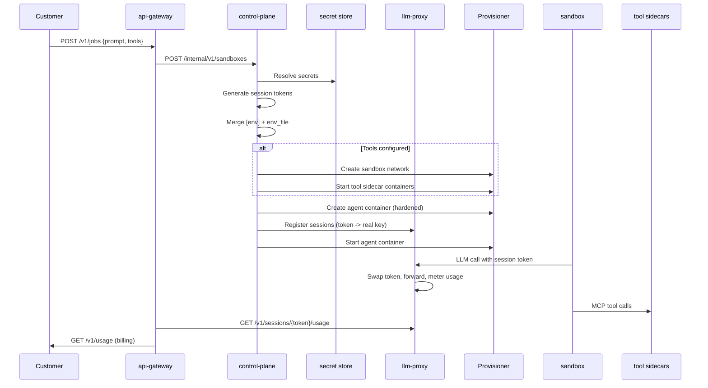

# Architecture

The control plane is the orchestrator for the entire agent sandbox system. It reads configuration, manages secrets, provisions sandboxes, coordinates the LLM proxy, starts MCP tool sidecars, and optionally restricts outbound network access. This document covers the full architecture across all services.

## System overview



## Services

| Service | Role | Runs on |
|---|---|---|
| **control-plane** | Orchestrator. Config, secrets, provisioning, tools, network policy. | Host (CLI or HTTP server) |
| **llm-proxy** | Stateless reverse proxy. Token validation, credential injection, token metering. | Host (daemon) |
| **sandbox-image** | Container image + entrypoint. Env stripping, privilege drop, exec agent. | Inside sandbox |
| **api-gateway** | Customer-facing REST API. Job submission, SSE streaming, billing. | Host (daemon) |
| **tools** | MCP tool sidecar containers. One per tool, on sandbox network. | Inside sandbox network |
| **agent** | Reference agent. LLM calls + tool execution loop. | Inside sandbox |

## Communication flow



## Boot sequence

The `Up` command in `pkg/orchestrator/orchestrator.go` runs these steps:

1. **Resolve secrets.** For each secret in `sandbox.toml`:
   - `inject` mode: read real value from store, add to env map
   - `proxy` mode: generate session token, add token to env, set provider base URL

2. **Merge environment.** Combine `[env]` table and `env_file` values into the env map.

3. **Set agent config.** `AGENT_COMMAND`, `AGENT_ARGS`, `AGENT_USER`, `AGENT_WORKDIR`.

4. **Set control plane URL.** `CONTROL_PLANE_URL` for the sandbox.

5. **Network allowlist.** If `[network] allowed_hosts` is set, inject `HTTP_PROXY` / `HTTPS_PROXY` pointing at the allowlist proxy.

6. **Build mounts.** Convert `shared_dirs` to bind mount specs.

7. **Create sandbox network.** If tools are configured, create an isolated Docker network.

8. **Start tool sidecars.** Launch each `[[tools]]` container on the sandbox network.

9. **Provision sandbox.** Call the provisioner with the env map, mounts, resource limits, and network ID.

10. **Register proxy sessions.** POST to llm-proxy for each `proxy` mode secret.

11. **Start sandbox.** The entrypoint takes over from here.

If any step fails, the orchestrator rolls back: destroys containers, revokes sessions, removes the network.

## Teardown

The `Down` command stops the container, destroys it, and cleans up tool sidecars and the sandbox network.

## Package structure

```
pkg/
├── config/          # sandbox.toml parsing + validation
├── secrets/
│   ├── iface.go     # Store interface
│   ├── store.go     # FileStore (JSON file)
│   ├── env.go       # EnvStore (env vars)
│   ├── delegated.go # DelegatedStore (AWS SM / Vault)
│   └── session.go   # Session token generation
├── provisioner/
│   ├── provisioner.go  # Provisioner interface
│   ├── docker.go       # Docker Engine API
│   ├── fly.go          # Fly Machines API
│   └── unikraft.go     # kraft.cloud API
├── orchestrator/
│   └── orchestrator.go # Boot + teardown + tool orchestration
├── allowlist/
│   └── proxy.go     # HTTP CONNECT forward proxy with host allowlisting
├── agent/
│   └── contract.go  # Agent I/O contract types
├── memory/
│   ├── iface.go     # Store interface
│   ├── sqlite.go    # SQLite backend
│   └── postgres.go  # PostgreSQL + pgvector backend
└── customer/
    └── profile.go   # Customer profile + secrets provider config

cmd/
├── up.go           # CLI: sandbox up
├── down.go         # CLI: sandbox down
├── status.go       # CLI: sandbox status
├── secrets.go      # CLI: secrets add/list/remove
├── serve.go        # HTTP server mode
└── helpers.go
```
