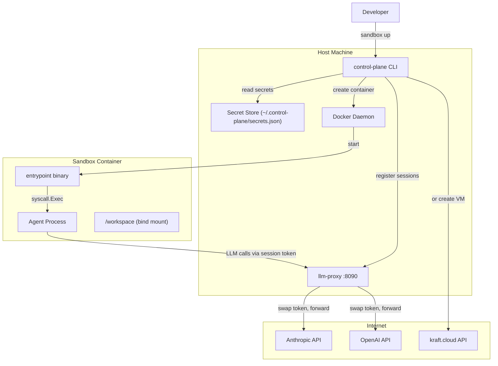
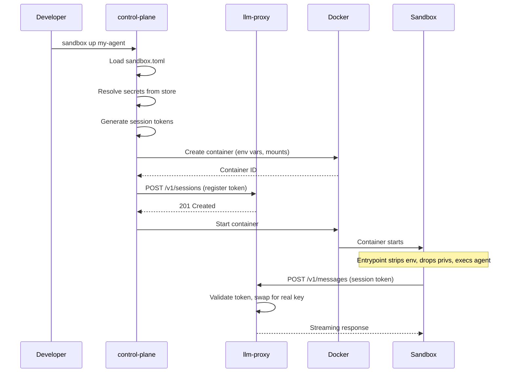

# Architecture

The control plane is the orchestrator for the entire sandbox system. It reads configuration, manages secrets, provisions sandboxes, and coordinates the LLM proxy. This document covers the full architecture across all three services.

## System overview



## The three services

| Repo | Role | Runs on |
|---|---|---|
| **control-plane** | Orchestrator. Reads config, manages secrets, provisions sandboxes, coordinates the proxy. | Host machine (CLI binary) |
| **llm-proxy** | Stateless reverse proxy. Validates session tokens, injects real API keys, streams responses. | Host machine (long-running daemon) |
| **sandbox-image** | Container image + entrypoint binary. Strips env vars, drops privileges, execs the agent. | Inside the sandbox (Docker container or Unikraft VM) |

They communicate over HTTP:



## Pattern 2: isolate the agent

This system implements "Pattern 2" from the Browser Use sandbox architecture: **the entire agent runs in an isolated environment with zero direct access to secrets**.

The key principle: the sandbox has no internet access for LLM calls. All API traffic is forced through the proxy on the host. The agent thinks it's talking to the LLM provider directly (the SDK base URL is set to point at the proxy), but the proxy is the one holding the real credentials.

This means:
- A compromised agent can't exfiltrate API keys (they're not in the environment)
- A compromised agent can't make unauthorized API calls (the proxy gates every request)
- The control plane can revoke access instantly by deleting the session

## Boot sequence

The `Up` command in `pkg/orchestrator/orchestrator.go` runs these steps in order:

1. **Resolve secrets.** For each secret in `sandbox.toml`:
   - `inject` mode: read the real value from the secret store, add it to the env map
   - `proxy` mode: generate a random session token, add the token to the env map, set the provider's base URL env var (e.g., `ANTHROPIC_BASE_URL`) to point at the proxy

2. **Set agent config.** Add `AGENT_COMMAND`, `AGENT_ARGS`, `AGENT_USER`, `AGENT_WORKDIR` to the env map.

3. **Set control plane URL.** Add `CONTROL_PLANE_URL` so the sandbox knows where the proxy is.

4. **Build mounts.** Convert `shared_dirs` from config into bind mount specs.

5. **Provision sandbox.** Call the provisioner (Docker or Unikraft) to create the container/VM with the env vars and mounts.

6. **Register proxy sessions.** For each `proxy` mode secret, POST to the llm-proxy with the session token, the real API key, and the provider name.

7. **Start sandbox.** Tell the provisioner to start the container/VM. The entrypoint takes over from here.

If any step fails, the orchestrator cleans up everything it already created (destroys the container, revokes proxy sessions).

## Teardown sequence

The `Down` command:

1. Stop the container/VM
2. Destroy the container/VM

Proxy sessions are ephemeral (in-memory) and don't survive a proxy restart. In the future, the teardown will also explicitly revoke sessions.

## Package structure

```
pkg/
├── config/
│   ├── config.go      # sandbox.toml parsing + validation
│   └── config_test.go
├── secrets/
│   ├── store.go       # JSON-backed secret store
│   ├── session.go     # Session token generation
│   └── store_test.go
├── provisioner/
│   ├── provisioner.go # Provisioner interface
│   ├── docker.go      # Docker Engine API backend
│   └── unikraft.go    # kraft.cloud REST API backend
└── orchestrator/
    └── orchestrator.go # Boot + teardown coordination

cmd/
├── up.go              # CLI: sandbox up
├── down.go            # CLI: sandbox down
├── status.go          # CLI: sandbox status
├── secrets.go         # CLI: secrets add/list/remove
└── helpers.go         # Shared CLI helpers
```
