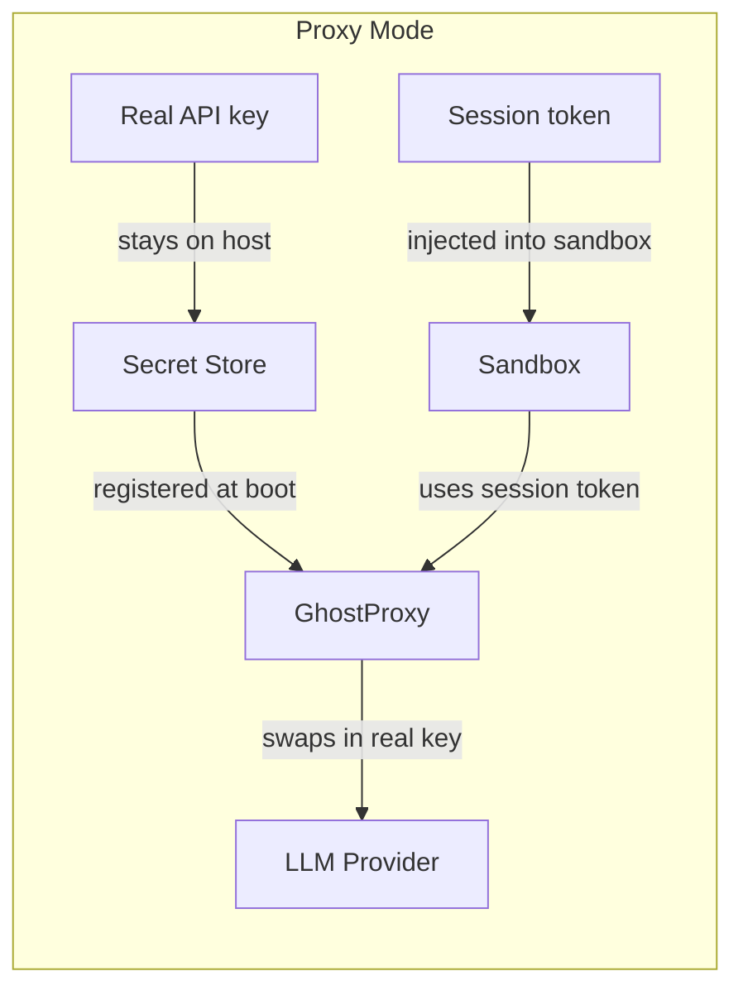
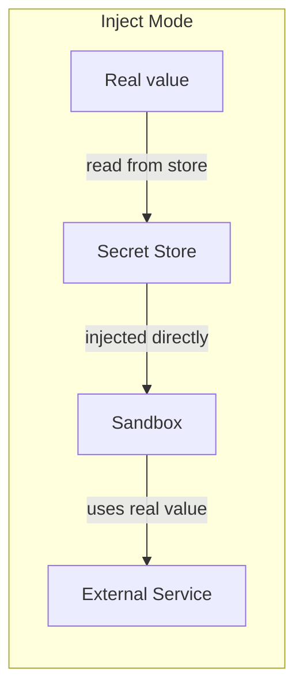
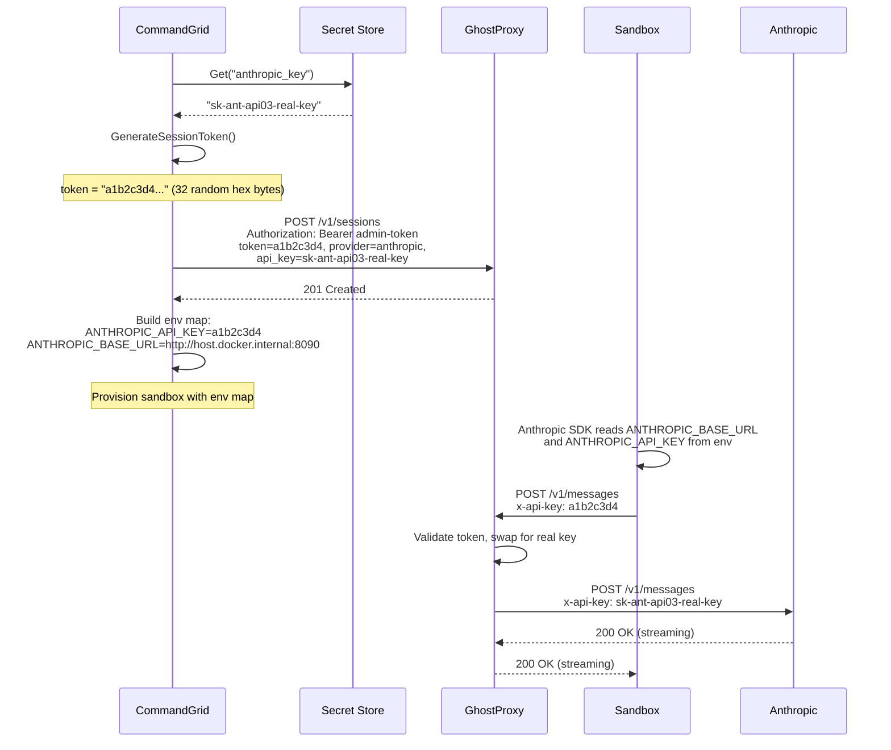

# Hybrid Credential Model

CommandGrid uses a hybrid approach to credential management. Some credentials are proxied (the real key never enters the sandbox), and others are directly injected as environment variables. The choice depends on the risk profile of the credential.

## Proxy vs inject





### When to use proxy mode

Use `mode = "proxy"` for credentials where:
- The credential is high-value (LLM API keys that cost money per call)
- The credential should be revocable without restarting the sandbox
- You want an audit point for all usage (the proxy sees every request)
- The service has a standard HTTP API that the proxy can forward

Typical proxy mode credentials: Anthropic API keys, OpenAI API keys, Ollama (even though it doesn't need auth, routing through the proxy gives you visibility).

### When to use inject mode

Use `mode = "inject"` for credentials where:
- The credential is used by a non-HTTP protocol (SSH keys, database passwords)
- The credential is used by a tool that doesn't support base URL configuration
- The credential is lower risk (personal access tokens for Git operations)
- The credential is a configuration value, not an auth secret

Typical inject mode credentials: GitHub tokens, SSH private keys, database URLs, registry tokens.

## How proxy mode works

### Session token lifecycle



### What the SDK sees

The agent's LLM SDK is configured entirely through environment variables:

| Env var set by CommandGrid | Value | SDK reads it as |
|---|---|---|
| `ANTHROPIC_API_KEY` | `a1b2c3d4` (session token) | "My API key" |
| `ANTHROPIC_BASE_URL` | `http://host.docker.internal:8090` | "API endpoint" |

The SDK sends requests to the proxy (thinking it's the Anthropic API) with the session token (thinking it's the API key). The proxy does the swap. The SDK never knows the difference.

### Provider base URL mapping

When a secret is in `proxy` mode, the orchestrator automatically sets the correct base URL env var:

| Provider | Env var set | Default value |
|---|---|---|
| `anthropic` | `ANTHROPIC_BASE_URL` | `http://host.docker.internal:8090` |
| `openai` | `OPENAI_BASE_URL` | `http://host.docker.internal:8090` |
| `ollama` | `OLLAMA_HOST` | `http://host.docker.internal:8090` |

These env var names are the ones each SDK looks for out of the box. No agent-side configuration needed.

## How inject mode works

Simple. CommandGrid reads the real value from the secret store and sets it as an env var:

```
sandbox.yaml:
  [secrets.github_token]
  mode = "inject"
  env_var = "GITHUB_TOKEN"

Secret store:
  github_token = "ghp_abc123..."

Container env:
  GITHUB_TOKEN=ghp_abc123...
```

The agent sees the real value. There's no proxy, no session token, no base URL redirect.

## Security tradeoffs

| Aspect | Proxy mode | Inject mode |
|---|---|---|
| Agent sees real credential | No | Yes |
| Revocable without restart | Yes (delete proxy session) | No (env var is set at boot) |
| Audit trail | Yes (proxy logs every request) | No |
| Works with non-HTTP protocols | No | Yes |
| Latency overhead | Minimal (one extra HTTP hop) | None |
| Requires GhostProxy running | Yes | No |

## Session token format

Generated by `secrets.GenerateSessionToken()` in `pkg/secrets/session.go`:

- 32 bytes of `crypto/rand`
- Hex-encoded to a 64-character string
- Prefixed with `session-` by convention when used in auth headers (but the prefix is optional -- the proxy strips it)

Tokens are ephemeral. They exist only for the lifetime of a sandbox run and are never persisted to disk. If the proxy restarts, CommandGrid must re-register tokens for any running sandboxes.

## Configuring secrets

Secrets come from env vars or a `.env` file (default provider). Set `SECRET_ANTHROPIC_KEY`, `SECRET_GITHUB_TOKEN`, etc., or create a `.env` file with keys matching the secret names in `sandbox.yaml`. See [secrets-local-dev.md](secrets-local-dev.md).

### Referencing a secret in sandbox.yaml

The key under `[secrets.*]` must match the name in the store:

```yaml
[secrets.anthropic_key]    # Looks up "anthropic_key" in the secret store
mode = "proxy"
env_var = "ANTHROPIC_API_KEY"
provider = "anthropic"
```

If the secret doesn't exist in the store at boot time, the `up` command fails with an error.
