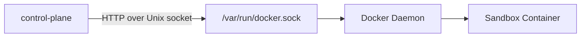
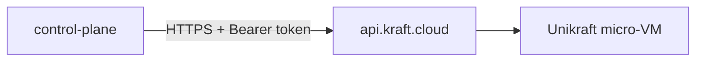

# Provisioners

The control plane has a pluggable provisioner interface for creating and managing sandboxes. Two backends are implemented: Docker (for local dev and Raspberry Pi) and Unikraft (for macOS and cloud).

## Interface

Every provisioner implements this interface (from `pkg/provisioner/provisioner.go`):

```go
type Provisioner interface {
    Create(ctx context.Context, opts CreateOpts) (*Sandbox, error)
    Start(ctx context.Context, id string) error
    Stop(ctx context.Context, id string) error
    Destroy(ctx context.Context, id string) error
    Status(ctx context.Context, id string) (*Sandbox, error)
    List(ctx context.Context) ([]*Sandbox, error)
}
```

The orchestrator doesn't care which provisioner is active. It calls the same methods regardless. The `sandbox_mode` field in `sandbox.toml` selects the backend.

## Docker provisioner

Source: `pkg/provisioner/docker.go`

### How it communicates

The Docker provisioner talks to the Docker daemon over its Unix socket (`/var/run/docker.sock`). It uses raw HTTP, not the Docker SDK -- this keeps the dependency tree small and avoids pulling in the entire Docker client library.



The HTTP client is configured with a custom `DialContext` that connects to the Unix socket instead of a TCP address. All requests go to `http://docker/...` -- the hostname is irrelevant since the transport ignores it.

### Container lifecycle

**Create** (`POST /containers/create?name={name}`):

The payload includes:
- `Image`: from `sandbox.toml`
- `Env`: all resolved env vars (secrets, agent config, control plane URL, provider base URLs)
- `HostConfig.Binds`: shared directory mounts as `host:guest[:ro]` strings
- `HostConfig.NetworkMode`: `"bridge"`
- `HostConfig.ExtraHosts`: `["host.docker.internal:host-gateway"]` -- this is how the sandbox reaches the proxy on the host
- `Labels`: `{"managed-by": "control-plane"}` -- used to filter containers in `List`

**Start** (`POST /containers/{id}/start`): Starts the created container. The entrypoint binary runs immediately.

**Stop** (`POST /containers/{id}/stop`): Sends SIGTERM, waits for graceful shutdown, then SIGKILL.

**Destroy** (`DELETE /containers/{id}?force=true`): Removes the container and its filesystem. Force flag skips the stop step if the container is still running.

**Status** (`GET /containers/{id}/json`): Returns container state (created, running, paused, restarting, removing, exited, dead) and network info.

**List** (`GET /containers/json?all=true&filters=...`): Returns all containers with the `managed-by=control-plane` label. The `all=true` flag includes stopped containers.

### host.docker.internal

The `ExtraHosts` config adds a DNS entry inside the container that resolves `host.docker.internal` to the host machine's IP. This is how the sandbox reaches the llm-proxy running on the host.

On Docker Desktop (macOS, Windows), `host.docker.internal` is built-in. On Linux (including Raspberry Pi), the `host-gateway` special value resolves to the host's IP on the bridge network.

The control plane sets `CONTROL_PLANE_URL=http://host.docker.internal:8090` and `ANTHROPIC_BASE_URL=http://host.docker.internal:8090` (etc.) so the sandbox can reach the proxy without knowing the host's actual IP.

### Bind mounts

Shared directories are implemented as Docker bind mounts. The `shared_dirs` from `sandbox.toml` are converted to bind strings:

```
./workspace:/workspace       (read-write)
./data:/data:ro              (read-only)
```

Relative host paths are resolved relative to the working directory where `sandbox up` is run.

## Unikraft provisioner

Source: `pkg/provisioner/unikraft.go`

### How it communicates

The Unikraft provisioner talks to the kraft.cloud REST API over HTTPS:



Authentication uses a bearer token from the `UKC_TOKEN` environment variable. Every request includes:
- `Authorization: Bearer {token}`
- `Content-Type: application/json`
- `Accept: application/json`

### VM lifecycle

**Create** (`POST /instances`):

Payload:
```json
{
  "name": "my-sandbox",
  "image": "my-registry.com/sandbox-image:latest",
  "memory_mb": 512,
  "env": { "AGENT_COMMAND": "my-agent", ... }
}
```

Default memory is 512MB. Environment variables are passed as a map (same as Docker). Bind mounts are not supported -- Unikraft VMs are more isolated than containers.

**Start** (`PUT /instances/{id}/start`): Boots the VM.

**Stop** (`PUT /instances/{id}/stop`): Gracefully stops the VM.

**Destroy** (`DELETE /instances/{id}`): Removes the VM and all associated resources.

**Status** (`GET /instances/{id}`): Returns VM state, private IP, and FQDN.

**List** (`GET /instances`): Returns all instances.

### Differences from Docker

| Feature | Docker | Unikraft |
|---|---|---|
| Runtime | Container (shared kernel) | Micro-VM (own kernel) |
| Boot time | ~1s | ~50ms |
| Isolation | Namespace + cgroup | Full VM boundary |
| Bind mounts | Yes | No |
| Host networking | `host.docker.internal` | Private network |
| Auth | Unix socket (local) | Bearer token (API) |
| Where it runs | Local Docker daemon | kraft.cloud |

### Network differences

In Docker mode, the sandbox reaches the proxy via `host.docker.internal`. In Unikraft mode, the proxy and sandbox are on different machines, so the proxy must be exposed on a routable address. The `CONTROL_PLANE_URL` and provider base URLs need to use the proxy's public address rather than `host.docker.internal`.

## Switching between provisioners

Change `sandbox_mode` in `sandbox.toml`:

```toml
# Local dev / Raspberry Pi
sandbox_mode = "docker"

# macOS cloud / production
sandbox_mode = "unikraft"
```

No code changes needed. The same `sandbox.toml` works for both (minus the shared_dirs, which are ignored in Unikraft mode).

## Adding a new provisioner

1. Create a new file `pkg/provisioner/mybackend.go`
2. Implement the `Provisioner` interface
3. Add a constructor (`NewMyBackendProvisioner`)
4. Wire it up in the CLI's `up` command where the provisioner is selected based on `sandbox_mode`

The interface is intentionally minimal. `Create`, `Start`, `Stop`, `Destroy`, `Status`, `List` -- that's it.
