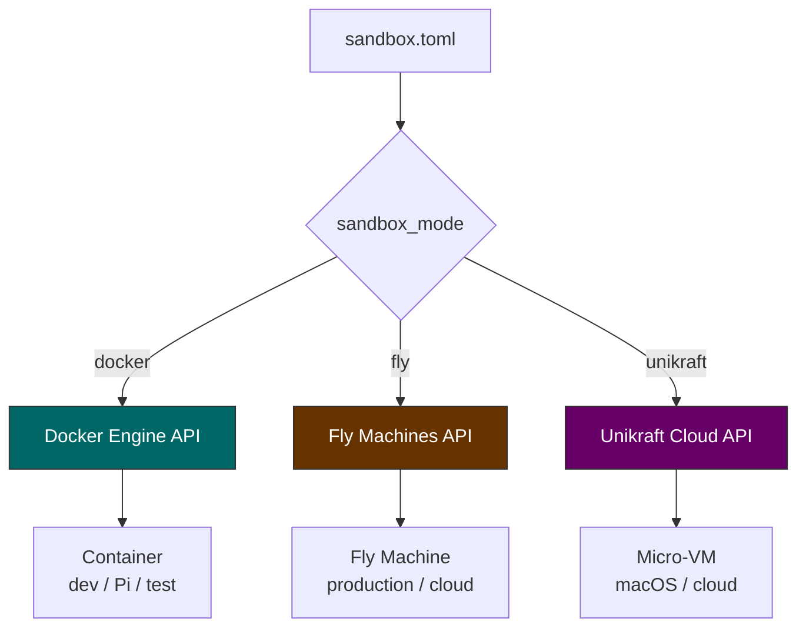
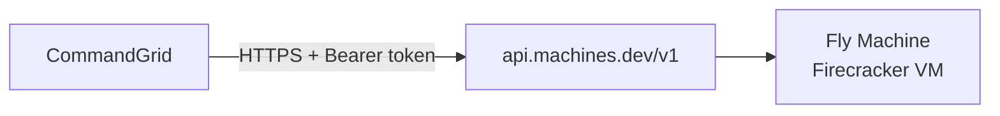

# Provisioners

CommandGrid has a pluggable provisioner interface for creating and managing sandboxes. Three backends are implemented: Docker (local dev / Pi), Fly Machines (production / cloud), and Unikraft (micro-VMs).

## Interface

Every provisioner implements this interface (from `pkg/provisioner/provisioner.go`):

```go
type Provisioner interface {
    Create(ctx context.Context, opts CreateOpts) (*Sandbox, error)
    Start(ctx context.Context, id string) error
    Stop(ctx context.Context, id string) error
    Destroy(ctx context.Context, id string) error
    Status(ctx context.Context, id string) (*Sandbox, error)
    List(ctx context.Context) ([]*Sandbox, error)
}
```

The orchestrator doesn't care which provisioner is active. It calls the same methods regardless. The `sandbox_mode` field in `sandbox.toml` selects the backend.

## Runtime comparison



| Feature | Docker | Fly Machines | Unikraft |
|---|---|---|---|
| Runtime | Container (shared kernel) | Firecracker VM | Micro-VM (own kernel) |
| Boot time | ~1s | ~300ms | ~50ms |
| Isolation | Namespace + cgroup | Full VM boundary | Full VM boundary |
| Bind mounts | Yes | No | No |
| Auth | Unix socket (local) | Bearer token (API) | Bearer token (API) |
| Where it runs | Local Docker daemon | Fly.io cloud | kraft.cloud |
| Best for | Dev, test, Raspberry Pi | Multi-tenant production | Ultra-lightweight cloud |

## Docker provisioner

Source: `pkg/provisioner/docker.go`

### Communication

Talks to the Docker daemon over the Unix socket (`/var/run/docker.sock`). Uses raw HTTP -- no Docker SDK dependency.


### Container lifecycle

| Operation | Docker API | Notes |
|---|---|---|
| Create | `POST /containers/create?name={name}` | Image, env, mounts, hardening, resource limits |
| Start | `POST /containers/{id}/start` | Entrypoint runs immediately |
| Stop | `POST /containers/{id}/stop` | SIGTERM then SIGKILL |
| Destroy | `DELETE /containers/{id}?force=true` | Removes container and filesystem |
| Status | `GET /containers/{id}/json` | State, network info, IP |
| List | `GET /containers/json?filters=...` | Filtered by `managed-by=CommandGrid` label |

### Security hardening

Docker containers get these security features automatically:

- **`CapDrop: ALL`** -- drop all Linux capabilities
- **`no-new-privileges`** -- prevent privilege escalation via setuid
- **`ReadonlyRootfs: true`** -- read-only root filesystem
- **`Tmpfs`** -- writable tmpfs at `/tmp` (256m) and `/run` (64m)
- **Memory limit** -- from `[resources] memory` (e.g. `"512m"`)
- **CPU limit** -- from `[resources] cpus` (e.g. `"1"`, converted to NanoCPUs)

### Networking

`host.docker.internal` is added via `ExtraHosts` so the sandbox can reach the proxy on the host. On Docker Desktop this is built-in; on Linux the `host-gateway` value resolves to the host's bridge IP.

The Docker provisioner also supports `CreateNetwork` and `RemoveNetwork` for per-sandbox isolation when tools are configured.

## Fly Machines provisioner

Source: `pkg/provisioner/fly.go`

### Communication

Talks to the Fly Machines REST API over HTTPS:



### Configuration

```go
FlyConfig{
    App:    "my-sandbox-app",     // Fly app name
    Region: "iad",                // Fly region
    Size:   "shared-cpu-1x",     // Machine size preset
    Token:  "FlyV1 ...",          // Fly API token
}
```

### Machine size presets

| Size | CPU Kind | vCPUs | Memory |
|---|---|---|---|
| `shared-cpu-1x` | shared | 1 | 256 MB |
| `shared-cpu-2x` | shared | 2 | 512 MB |
| `performance-1x` | performance | 1 | 2 GB |
| `performance-2x` | performance | 2 | 4 GB |

### Machine lifecycle

| Operation | API | Notes |
|---|---|---|
| Create | `POST /apps/{app}/machines` | Image, env, guest config, auto-destroy |
| Start | `POST /apps/{app}/machines/{id}/start` | Boots the VM |
| Stop | `POST /apps/{app}/machines/{id}/stop` | Graceful shutdown |
| Destroy | `DELETE /apps/{app}/machines/{id}?force=true` | Removes VM |
| Status | `GET /apps/{app}/machines/{id}` | State, private IP |
| List | `GET /apps/{app}/machines` | All machines in the app |

### When to use

Fly Machines provide Firecracker-level isolation for multi-tenant production. Each sandbox is a separate VM -- a compromised agent can't escape to other tenants. The auto-destroy flag ensures machines clean up after themselves.

## Unikraft provisioner

Source: `pkg/provisioner/unikraft.go`

Talks to the kraft.cloud REST API. Requires `UKC_TOKEN` env var. Fastest boot time (~50ms) but no bind mount support. Best for ultra-lightweight, stateless workloads.

## Switching between provisioners

Change `sandbox_mode` in `sandbox.toml`:

```toml
# Local dev / Raspberry Pi
sandbox_mode = "docker"

# Production cloud
sandbox_mode = "fly"

# Unikraft micro-VMs
sandbox_mode = "unikraft"
```

No code changes needed.

## Adding a new provisioner

1. Create `pkg/provisioner/mybackend.go`
2. Implement the `Provisioner` interface (6 methods)
3. Add a constructor (`NewMyBackendProvisioner`)
4. Wire it up in the CLI's `up` command where the provisioner is selected based on `sandbox_mode`
